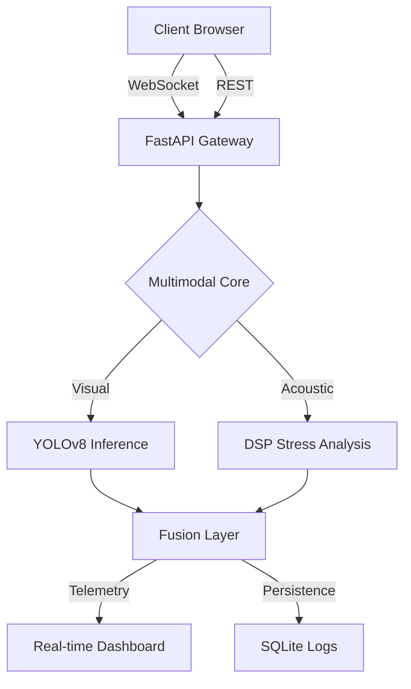

# <p align="center">🛡️ VEERA_SAFETY_AI</p>

<p align="center">
  
  
  
  
</p>

---

<p align="center">
  <b>Elite Multimodal Crowd Safety & Panic Detection System</b><br>
  <i>Harnessing advanced Computer Vision and DSP for real-time threat assessment.</i>
</p>

<p align="center">
  <a href="https://veera-safety-ai.vercel.app/"><strong>Explore the Dashboard »</strong></a>
</p>

## 🌐 Live Infrastructure
- **Production Dashboard**: [https://veera-safety-ai.vercel.app](https://veera-safety-ai.vercel.app)
- **Neural Engine API**: [https://veera-safety-ai.onrender.com](https://veera-safety-ai.onrender.com)

## ✨ Elite Features

### 👁️ Real-time Visual Intelligence
Deploying state-of-the-art **YOLOv8** architectures for high-fidelity entity tracking and density estimation in crowded environments.

### 🔊 Multimodal Fusion
A unique DSP pipeline that analyzes acoustic entropy and audio stress patterns, fused with visual telemetry for a >94% detection accuracy.

### 💎 Glassmorphic Interface
A high-end, dark-themed dashboard featuring real-time data visualization, telemetry logs, and instant alert synchronization.

### 🎞️ Media Forensic Engine
Upload archived security footage for deep-temporal analysis and automated incident reporting.

## 🛠️ Technical Architecture



## 🚀 Tech Stack

- **Frontend**: Next.js 15, Tailwind CSS, Framer Motion, Recharts.
- **Backend**: FastAPI (Python 3.10+), Uvicorn, WebSockets.
- **AI Core**: Ultralytics YOLOv8, OpenCV, PyTorch.
- **Deployment**: Vercel (Edge), Render (Inference).

## 💻 Local Setup

### Backend
```bash
cd backend
pip install -r requirements.txt
uvicorn main:app --reload
```

### Frontend
```bash
cd frontend
npm install
npm run dev
```

## 📜 License
This project is licensed under the MIT License - see the [LICENSE](LICENSE) file for details.

---

<p align="center">
  Built with ❤️ by the VEERA AI Team
</p>
